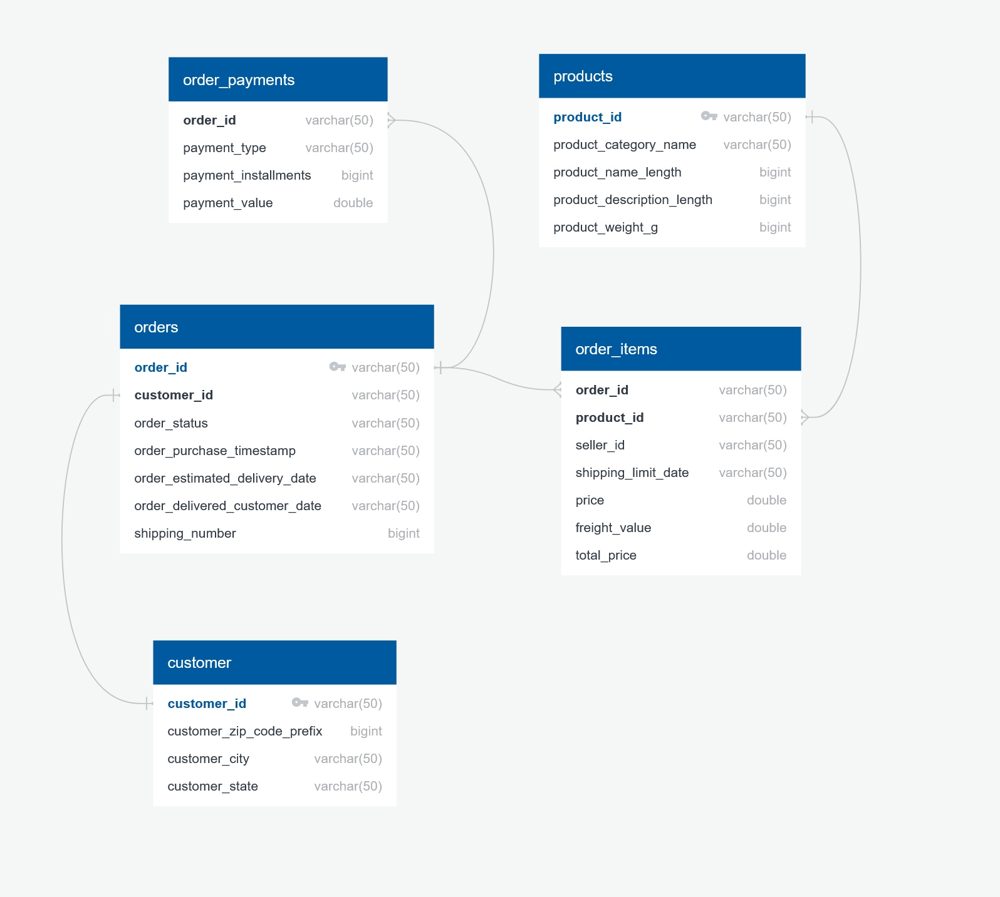
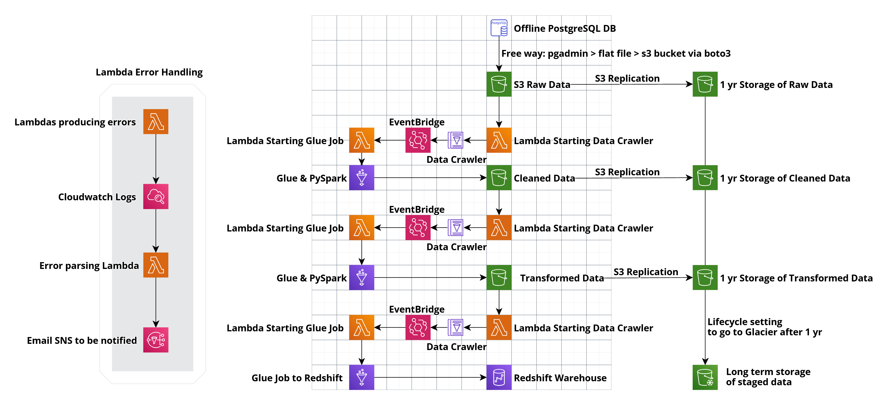

# AWS-ETL-Pipeline Project

### Problem Statement:

An E-Commerce company with an on prem database wants to move into the cloud (AWS). How can they achieve this transition successfully?

### Current ERD (Entity Relationship Diagram):

There are currently 5 tables in 3NF with orders containing the most important data. There are several one-to-many connections to take note of as well.

### Architecture for ETL Job in AWS

The following is the general Architecture for my plan on moving the data from an on prem database into. All code for this project is available within this repo. Everything else is within my AWS account, if you have any questions feel free to reach out to me.

Disclaimer: In order to keep costs down as much as possible (I paid for this out of pocket), I tended to move towards free tier or low-cost path options, that is not to say that this is the most efficient way or would be the only way to do so in production, but this worked for me on this project.

To start, my offline database is in a PostgreSQL DB within PGAdmin. Using SQL, I took copies of all the tables into flat files and then had them within a folder. In a typical production, a database migration service would work for this step as well and automate this process a bit better.

I then took these flat files and within a Notebook using Boto3 uploaded them into my initial landing area (S3 Raw Data). 

There are 3 phases in this project to get this data from initial landing area to a Redshift Data Warehouse. These three phases repeat themselves with some variations based on what step in the process is being observed.

First, I will detail the S3 buckets. There are 6 of them and they all have a specific purpose. The landing buckets for each phase (S3 Raw Data, Cleaned Data, Transformed Data) are meant to only have objects in them when they initially land. After they have served their purpose, the data within these buckets are then deleted with functions created in earlier notebook for initial uploads (not automated atm but can be with Lambda functions later). All data that lands is replicated into other 1yr titled buckets for long term storage in case different stages need to be re-run. All three 1 yr buckets have lifecycle properties to move anything > 1 yr into Glacier for long term storage.

Next, I will talk about what one phase in this process consists of and the goals surrounding this method. Just to be clear, when I am talking about phases, I am referring to how data goes from S3 Raw > Cleaned and then from Cleaned > Transformed and then finally from Transformed > Redshift Warehouse.

When objects lands in the Raw Data bucket, the first thing that is triggered is a Lambda function that notifies the glue Data Crawler to turn on and crawl the data within the Raw Data bucket. Once that crawler finishes, and EventBridge notification is created which is the trigger for another lambda function to start the first glue job. This first glue job is to clean the data, and then deposit each table into their respective folder (Orders data is sent to the Orders folder in the Cleaned Data Bucket etc..). This process is relatively simple and gets to the point with moving and transforming data.

This process is extremely similar for the other 2 phases with a few changes. Since the data is now cleaned, the next glue job only transforms the data, with the final glue job only moving the data from the final Data Crawler into the tables we created within Redshift. All tables are insert only except the products table which is update and insert only due to the uniqueness of one product not needing to be replicated.

### Error Handling

Although not fully complete, one of the biggest events that can stop this pipeline dead in its tracks is if the Lambda functions are not working properly. Since the entire process is automated (From initial upload to being in Redshift) and nothing needs to be touched after that initial upload, having one thing not working can be catastrophic. To combat this, I implemented a way to track and follow errors for this pipeline. When Lambda functions produce errors, I have them being tracked in CloudWatch logs. Another Lambda is then scanning these logs looking for certain errors. When these errors are found, this Lambda function then turns on email SNS so that I can be notified.

### Conclusion

This was my first project discovering and looking into an ETL Pipeline using AWS services. There are tons of different ways for me to improve the pipeline and get it into a more production ready state and I am planning on making more improvements in the future. Thanks  for taking a look at my project.
